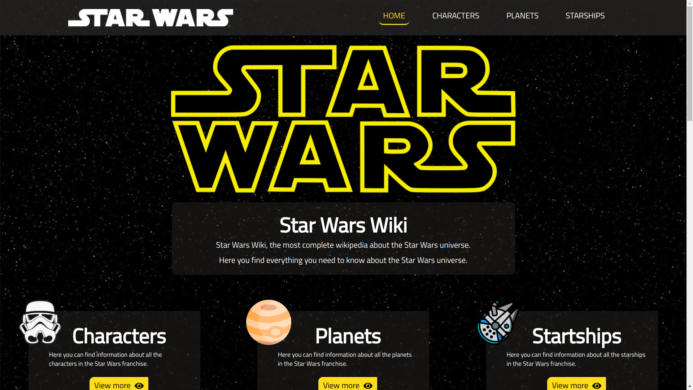
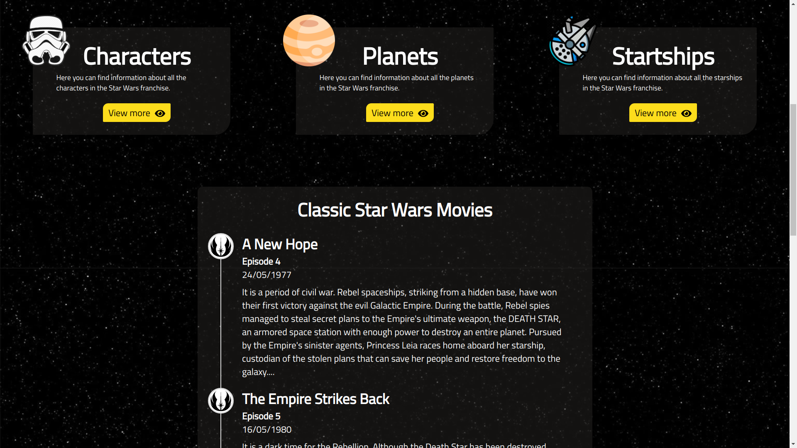
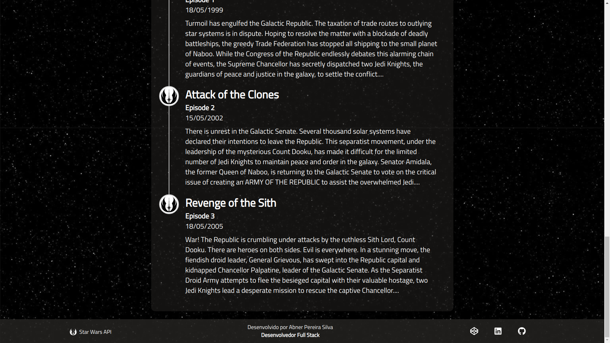
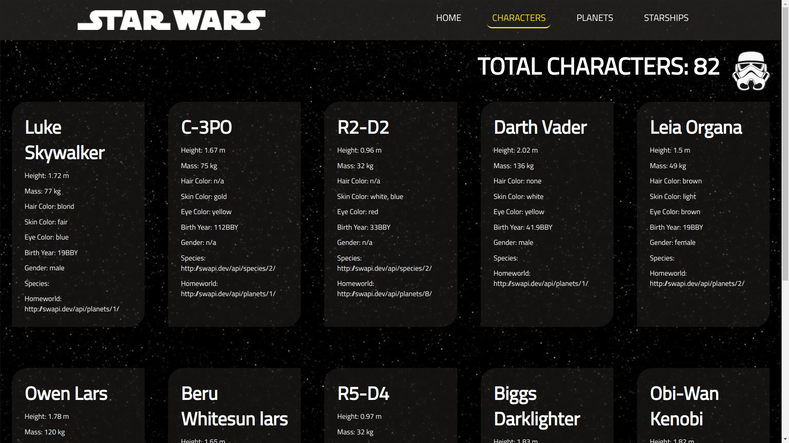
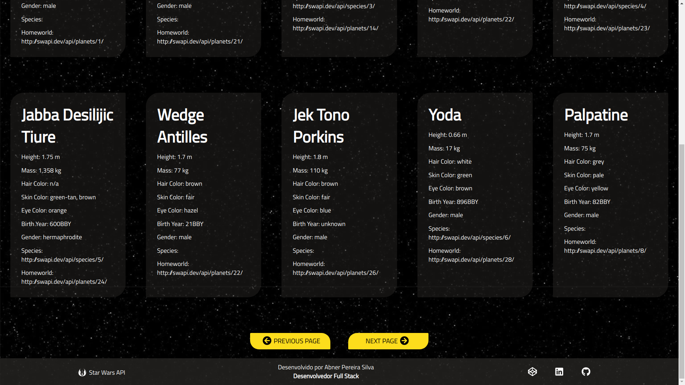
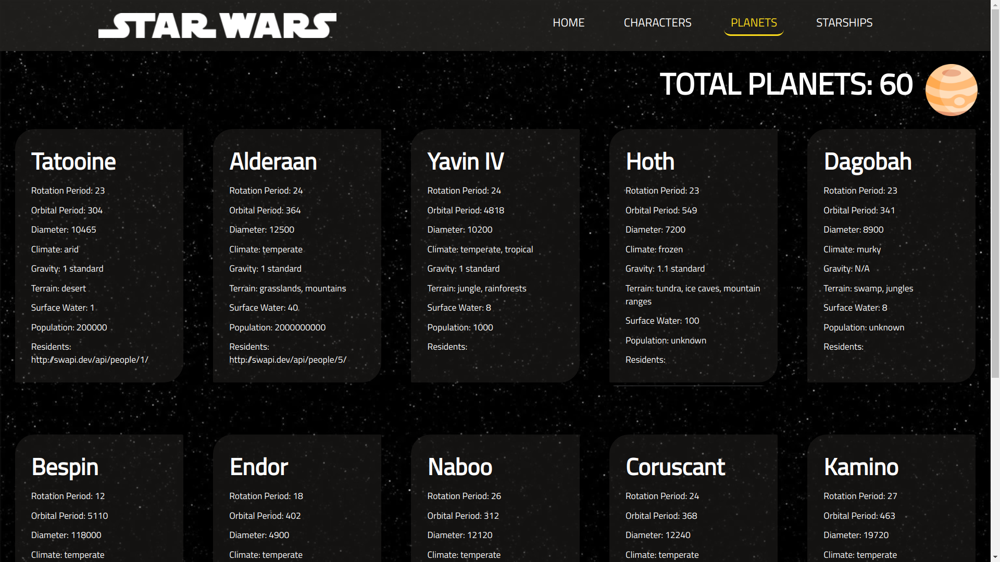
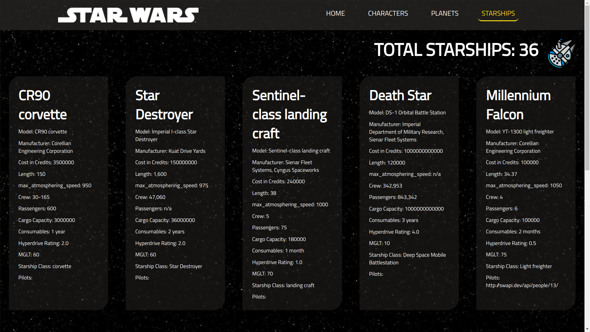

<h4 align="center">

<br><br>
 ✴️ A Wikipedia completa do universo Star Wars ✴️
</h4>
<p align="center">
    
    
    
    
    
</p>

# 🚀 Sobre o projeto 

A [Star Wars Wiki](https://AbnerPS.github.io/star-wars-wiki) é uma aplicação web com muitas informações sobre o universo da franquia Star Wars fornecidas pela [Star Wars API](https://swapi.dev/).
Conheça mais sobre os filmes, personagens, planetas e espaço-naves do universo Star Wars. 🤓

# ⚙️ Como executar


Para executar e testar a aplicação na sua máquina, primeiramente clone o repositório no seu computador.
Após clonar e ter todos os arquivos na sua máquina, entre na pasta raiz do repositório **" ./ "** e abra seu terminal nela.

No terminal, digite o seguinte comando para instalar todas as dependências:

```bash
$ npm install
```

Com todas as dependências instaladas, agora é só executar o seguinte comando:

```bash
$ npm start
```

**E pronto, agora você pode usar à vontade toda a aplicação.** 😁

# 🧑🏽‍💻 Tecnologias

Segue abaixo uma lista com as principais técnologias utilizados no desenvolvimento desta aplicação. Lembrando que tudo foi desenvolvido utilizando a linguagem [Javascript](https://www.javascript.org/).

### ⚛️ Frameworks
- [x] [React](https://pt-br.reactjs.org/)

### 📚 Bibliotecas e Dependências
- [x] [Axios](https://github.com/axios/axios)
- [x] [RSuite](https://rsuitejs.com/)
- [x] [Date-fns](https://date-fns.org/)

# :computer: Screenshots

<p align="center">
  
</p>

<p align="center">
  
</p>

<p align="center">
  
</p>

<p align="center">
  
</p>

<p align="center">
  
</p>

<p align="center">
  
</p>

<p align="center">
  
</p>

 # :tv: Redes Sociais
 Me siga nas minhas redes sociais 😊
 
   <a href="https://github.com/AbnerPS" target="_blank" >
    </a> 
  
  <a href="https://www.instagram.com/abner.p.s/" target="_blank" >
    </a> 
  
  <a href="https://www.facebook.com/AbnerGuthiwill" target="_blank" >
    </a> 

  <a href="https://www.linkedin.com/in/abner-pereira-silva-8715a326/" target="_blank" >
    </a>